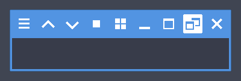

Mowi
====

A modest window theme for [xfwm4].

Picks up system colors. Title bar sizes
24, 48, 72, and 96. Distributed under the [CC0].

[xfwm4]: https://docs.xfce.org/xfce/xfwm4/start
[CC0]: https://creativecommons.org/publicdomain/zero/1.0

Make
----

Dependencies:

- Common bash, sed, etc.
- magick

Check the [xfwm4 wiki] for details about the theme files.
The themes can be generated with the make script:

	./make.sh

[xfwm4 wiki]: https://wiki.xfce.org/howto/xfwm4_theme
